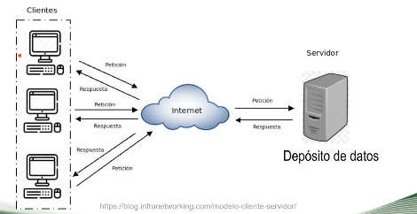

# DICOM- parte 1 

Fecha: 18 Noviembre 2021 

## 1. Definición

* Digital imaging and communications in medicine (DICOM) es el estándar para la comunicación y gestión de información de imágenes médica y datos relacionados. 

* Transferencia de datos sin ningún problema

* Facilita la interoperabilidad de equipos de imágenes médicas al especificar:
    - Comunicaciones de red
    - La sintaxis semántica de los comandos y la información asociada que se puede intercambiar utilizando estos protocolos.
    - Conjunto de servicios de almacenamiento para facilitar 

* Es gestionado por la alianza técnica médica y de imágenes (MITA), una división de NEMA. Versión actual del estándar: DICOM PS3.1 2021 documento estructurado conformado por 22 partes. 

**Modelo de información**: Varias modalidades como PET, tomografías, entre otros. Luego se obtiene una serie de imagenes y es traducido en un esquema 

*Jerarquía:* 
paciente-> estudio -> Series (frontal, sagital, coronal). 

### Estructuras 
**Entidades de información**
se tiene información del:

- **Equipo**
- **Paciente**: Se encuentran los atributos que corresponden al paciente: Nombre, sexo, ID, entre otros. Cada atributo tiene un identificador único. 
    * **Atributo**: cada atributo o data element esta conformado de: tag, value, representation, value length y value. 
- **Imagen**: información técnica de lo que contiene la imagen
- **Series** 

1. Información de la imagen:
    * Image IE
    * Frame of reference IE
    * Serie IE
2. Información del contexto:
    * Patient ID-> Date of birth, Name, Species
    * Equipment ID -> Manufacturer, Serial Number
    * Study ID

DICOM, contiene información del estudio, y adicionalmente tenemos metadatos relacionados con la imágen médica y digital. 

### Estructura-> **Objetos de información definidos**  (IODs)
Es un tipo de plantilla que contiene los atributos, para representar la información total: DATA + METADATA.

IODs-> IOD atribute | IOD instance  

### Modelo de comunicación

* Upper layer service proporciona independencia del soporte y protocolos de comunicación de redes físicas específicas tales como TCP/IP.
* El servicio web permite la transferencia de servicios por medio de HTTP y protocolos asociados.
* El servicio de archivos provee acceso al almacenamiento en disco de los datos con estructura y formato adecuado. 

## 2. DICOM en el flujo de trabajo

* Establece bases de datos
* Define metados relacionados con los estudios
* Orquesta el intercambio de información
* Servicios: almacenamiento, consultas, listas de trabajo, gestión multimodal
* Visualización
* Ficheros

#### Modelo cliente-servidor
Peticiones o consultas al servidor, en este caso el PACS, que contiene el deposito de imágenes DICOM. 

 

En la transferencia de protocolos de TCP/IP, permite identificar nuestro equipo y apartir de ella podemos relacionarnos con otros dispositivos, nos permite la comunicación.

**AE: application entity**. Se tiene que especificar el nombre, el equipo con el que me quiero comunicar, tiene la capa de aplicación que es el protocolo DICOM, la capa de transporte y se encuentra la capa física que hace referencia al hardware del equipo. 

A partir de AE vamos a tener un usuario y un proveedor.

* SCU: Service class user
* SCP: Service class provider
Hago una petición a un query y por medio del servicio se hace la petición y se remite una respuesta 

Me permiten realizar la transferencia de información 
* DICOM message service elemnt (DIMSE)
* Information object definition (IOD)

La relación usuario-proveedor no es en una sola dirección. Dependiendo de lo que se requiera la AE. 

 

## 3. Imágenes digitales

El protocolo DICOM, tiene un campo sobre la imágen. Las caracteristicas de la imagen van a depender de la modalidad. 

1. **Profundidad**: Cantidad de bits necesarios para representar el número de niveles de gris.

**Resolución y profundidad según modalidades**

## 4. Otros formatos

Los más comúnes:
* DICOM: Se almacena en la cabecera información del sujeto
* NIFTI: 
* ANALYZE:Se tiene imagenes en formato `.img`. La cabecera se almacena en otro archivo [].

## 5. Opciones de compresión según 

 

## 6. Herramientas para manipulación de imágenes DICOM dcm4che 5 toolkit 

* dcm4chee. Son útiles 

**pydicom**
Librería de python para trabajar con archivos DICOM. Permite manipulación de información y visualización de imágenes.

Elementos importantes al trabajar con pydicom:
* Dataset
* DataElement: es una clase 
