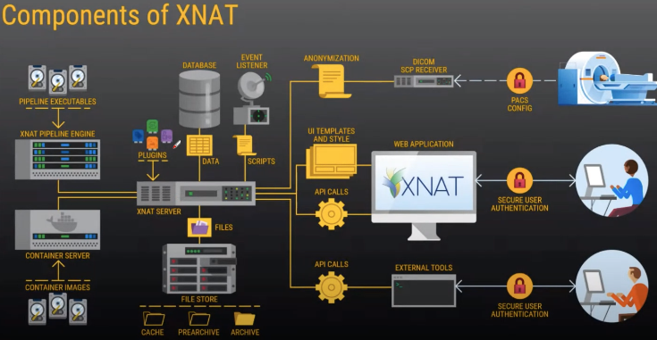
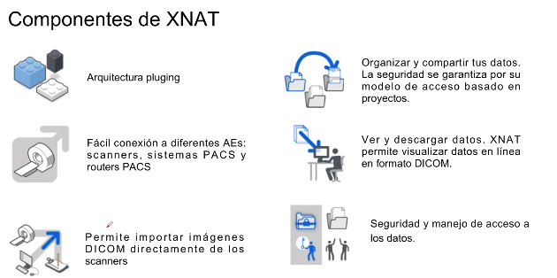
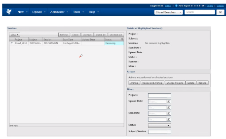
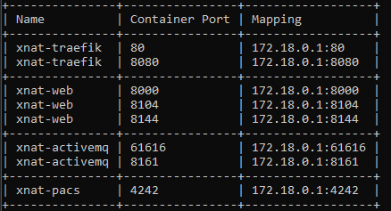

# XNAT

Fecha: 23 Noviembre 2021 
## ¿Qué es XNAT?

* Plataforma de software de informática médica de código abierto
* Orientada a la ejecución de investigación con imágenes médicas
* Importar, almacenar, procesar y distribuir imágenes y otro tipo de información del estudio de manera segura. 

<center>
 
</center>


### Componentes de XNAT
<center>
 
</center>

* Busqueda y exploración de grandes datasets. Permite almacenar, navegar y consultar datos

* Ejecutar procesamiento complejo en los datos usando computación avanzada
* Incluye iun motor de pipelines para programación de flujos de trabajo complejos conmúltiples niveles de automatización 

### DICOM SCP Receiver

Una ocpión para enviar datos desde un scanner a XNAT
<center>

</center>

Se le vincula un proyecto, es como una carpeta temporal, y se redirige a los proyectos propios. 
<center>
  
</center>

### Plugins

Son usados por XNAT com ouna manera de extender su funcionalidad.

Cada plugin está empaquetado en su propio contenedor que puede ser implementado de forma separada y distinta de la aplicación principal

### Container server

* Permite ejecutar aplicaciones desarrolladas fuera de XNAT. 
* Se pueden asociar por medio de docker Hub.
* Se pueden definir los comandos para ejecución del contenedor en la plataforma XNAT


## Correr XNAT en una máquina virtual
1. Descargar virtual box
2. Descargar vagrant 

**Nota:** Se utilizaron puertos especificos debido a las especificaciones que solicitaba. En caso de tener un puerto que ya este escuchando deshabilitar. 
<center>
  
</center>

3. Correr en en carpeta las siguientes líneas en una terminal: 
 ```js 
 vagrant init 
 vagrant up 
 vagrant ssh 
 ```
Modificar el vagrantfile con los puertos que necesita XNAT, asignarle 4GB para la máquina virtual
[vagrantfile](https://github.com/luisam19/PDI/blob/main/Vagrantfile) 

4. instalar docker en ubuntu
seguir los pasos: <https://docs.docker.com/engine/install/ubuntu/>
5. Instalar docker compose
seguir los pasos: <https://docs.docker.com/compose/install/>
6. Página de la memoria
Seguir los pasos:  <https://phoenixnap.com/kb/docker-memory-and-cpu-limit>
7. Instalar gradle
```js
sudo apt install gradle
```
8. correr los primeros pasos de la guía de la instalación Aura 
```js
// clonar repositorio
$ git clone https://github.com/NrgXnat/xnat-docker-compose 
$ cd xnat-docker-compose
$ git checkout features/dependency-mgmt
// Crear copia de archivo de configuración
$ cp default.env myProps.env
$ ./gradlew composeBuild composeUp
$ ./gradlew composeDown //Recomendación: siempre bajar los servicios 
// Lanzar especificando entorno y archivo de manifiesto
$ ./gradlew -PenvFile=default.env -Pmanifest=sample.manifest-XNAT-ML-18 fullStackComposeBuild fullStackComposeUp
```
9. 
```js 
sudo docker-compose up -d 
```
10. 1. Añadir plugin DRQ ->ir hasta plugins 
```js
sudo wget https://bitbucket.org/xnatdev/dicom-query-retrieve/downloads/dicom-query-retrieve-1.0.1-xpl.jar
```
11. Dirigirse al `localhost` en el servidor que este usando 

**user:** admin
**password:** admin

**Configurar los receptores DICOM SCP**
- Ir a Administer/Site Administration/DICOM SCP Receivers
- Clic en New DICOM SCP Receiver
- Ingresar la siguiente información: 
    * AE Title: XDQR
    * Port: 8104
    * Custom Processing: Enabled
    * Identifier: dqrObjectIdentifier 
- Clic en New DICOM SCP Receiver para crear otro receptor
- Ingresar la siguiente información: 
    * AE Title: XNAT
    * Port: 8144
    * Custom Processing: Disabled

Identifier: dicomObjectIdentifier (Default)
**Configurar nodo DICOM para ORTHANC**
- Ir a Administer/Plugin Settings/DRQ Settings
- Clic en Add New DICOM AE
- Ingresar la siguiente información: 
    * AE Title: ORTHANC
    * Host: IP
    * Label: ORTHANC
    * Port: 4242
    * Queryable: yes
    * Default Q/R AE: yes
    * Storable: yes
    * Default Storage AE: yes
- Clic en ping para verificar la conexión
_________________________________________________
### Controlar las instancias

1. Bajar las instancias
```js
$ docker-compose down
```
2. Bajar las instancias y eliminar las imágenes construidas
```js
$ docker-compose down --rmi all
```
3. Los pasos anteriores se pueden realizar utilizando los siguientes comandos con gradlew
```js
$ ./gradlew composeDown
$ ./gradlew composeDownForced
```
4. Subir las imágenes nuevamente
```js
$ docker-compose up -d
$ ./gradlew composeUp
$ ./gradlew fullStackComposeUp
```
5. Reiniciar
```js
$ docker-compose restart xnat-web
```
___________________________________________
### Instalación Docker en Windows 10 con WSL
1. Revisar guía oficial de instalación: https://docs.docker.com/desktop/windows/wsl/
2. Prerequisitos
- Habilitar WSL 2 en Windows siguiendo las siguientes [instrucciones](https://docs.microsoft.com/en-us/windows/wsl/install)
- Descargar e instalar el paquete de actualización de kernel de linux siguiendo las siguientes [instrucciones](https://docs.microsoft.com/en-us/windows/wsl/install). Instalar
la distribución Ubuntu 18.04 LTS.
- Configurar Docker Desktop siguiendo las siguientes [instrucciones](https://docs.docker.com/desktop/windows/wsl/) .

___________________________________________
### Configuración de JAVA
- Para Ubuntu 18.04 LTS.
```js 
sudo apt-get update
sudo apt-get install openjdk-8-jdk
java -version
```
Luego exportar la ruta
```
export JAVA_HOME=path_to_java_home (debe ser algo similar a esto: &quot;/usr/lib/jvm/open-jdk&quot;)
```
Verificar la existencia de la ruta
```js
echo ${JAVA_HOME}
```


