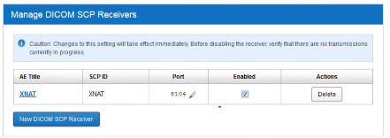

# XNAT

Fecha: 23 Noviembre 2021 
## ¿Qué es XNAT?

* Plataforma de software de informática médica de código abierto
* Orientada a la ejecución de investigación con imágenes médicas
* Importar, almacenar, procesar y distribuir imágenes y otro tipo de información del estudio de manera segura. 

  

### Componentes de XNAT
  

* Busqueda y exploración de grandes datasets. Permite almacenar, navegar y consultar datos

* Ejecutar procesamiento complejo en los datos usando computación avanzada
* Incluye iun motor de pipelines para programación de flujos de trabajo complejos conmúltiples niveles de automatización 

### DICOM SCP Receiver

Una ocpión para enviar datos desde un scanner a XNAT

  

Se le vincula un proyecto, es como una carpeta temporal, y se redirige a los proyectos propios. 

  

### Plugins

Son usados por XNAT com ouna manera de extender su funcionalidad.

Cada plugin está empaquetado en su propio contenedor que puede ser implementado de forma separada y distinta de la aplicación principal

### Container server

* Permite ejecutar aplicaciones desarrolladas fuera de XNAT. 
* Se pueden asociar por medio de docker Hub.
* Se pueden definir los comandos para ejecución del contenedor en la plataforma XNAT

