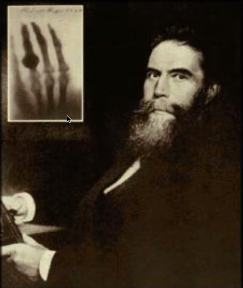
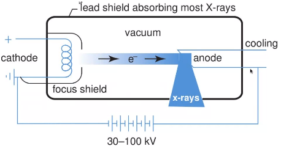
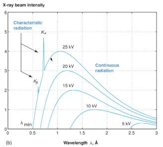
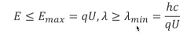
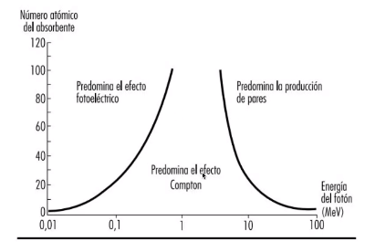
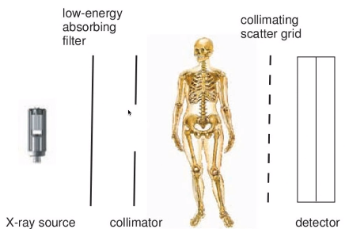

# Formación de la imagen por rayos-X

Fecha: 25 Noviembre 2021 

* La teoría atómica. ¿Hasta dónde se puede dividir un objeto material?. 
Nace el atomo, que no se puede dividir más. Casi 2000 años que no se sabía a ciencia cierta la existencia del atomo. Ya se conoce las subparticulas del atomo. Se fue desarrollando durante mucho tiempo.
* Contradicción de la energía cuántica. 
* Fotón portador de la energía electromagnetica. 

### Introducción rayos-X
* Los rayos X fueron descubiertos por Wilhelm Rontgen en 1895 mientras realizaba experimentos irradiando pantallas fluorecentes con tubos de rayos catódicos.
* Las pantallas fluorecentes emitian luz incluso cuando los tubos se encontraban dentro de cajas de cartón. Rontgen concluyo que los tubos estaban generando otro tipo de radiación que nombro rayos-X
* Rontgen descubrio que esta radiación podía atravesar diferentes tipos de materiales.

 

* Los rayos-X son radiación electromágnetica (fotones)

* El espectro electromagnético puede ser dividio en múltiples bandas de frecuencia.  Desde las ondas de radio hasta los rayos gamma (de alta frecuencia usados en aplicaciones de medicina nuclear). 

* La longitud de los rayos-X se encuentra en el rango de los Angtrom y su energía esta en el orden de los KeV

### Generación
* Los rayos-X son generados con un tubo de rayos-X que consiste en un rubo al vació con un cátodo y un ánodo

1. La corriente en el cátodo libera electrones por excitación térmica
2. Esos electrones son acelerados hacia el ánodo por un voltaje entre en ánodo y cátodo. 
3. Interacción con el anodo, generando los rayos X

* A menor longitud de onda mayor radiación
* Los electrodos cuando se aceleran se dan contra el anodo. La velocidad de frenado se da cuando los electones pasan cerca .... El espectro es continuo. Experimenta mayor decremento de la velocidad. 
* A mayor voltaje salen fotones de más energía.
* La relación caracteristica se da, porque algunos de esos electrones tienen tanta energía que son capaces de desprenderse del nucleo, se libera un fotón que es altamente energico. 
* Los electrones más alejados del nucleo son más dificiles de desprender, por el contrario los más cercanos al núcleo es más difíciles de desprender. 
* Los picos son discretizados, dado que la energía esta cuantizada. 
* Radiación carac: La energía de un electrón incidente puede liberar un electrón que se encuentre cercano al núcleo dejando un "agujero". Entre más cercano este un electron al nucleo menor es su energía 

* La energía, espresada en eV y la longitud de onda para este tipo de radiación esta limitada por:

### Parámetros equipo rayos-X

* La cantidad de electones emitidos. Depende de la corriente en el cátodo y el tiempo de generación (típicamente de 1 a 100 mAs)
* El voltaje entre el ánodo y el cátodo. Determina con que energía llegarán los electrones al ánodo.
* La energía total incidente en el ánodo. Depende de los dos factores anteriores y se expresa en joules.  Se libera en forma de calor.

### Interacción con la materia
Una vez que se liberan los electrones cómo interactuan. Existen dos tipos de interacción:
1. **A nivel de los fotones**:
Los rayos X y gamma son radiaciones ionizantes, que son capaces de desprender un electrón alterando su carga total. 

Los fotones con energías menores a 13.6 KeV son *no ionizantes*, tan solo son capaces de excitar un electrón de manera que cambie de nivel de energía dentro del átomo. 

2.**Dispersión de Rayleigh o dispersión coherente**

2.1 La energía del fotón es absorbida por un átomo.

2.2 El cual libera un nuevo fotón con la misma energía pero viajando en una dirección diferente 

* Las mamografías son de menor calidad, menor resolución ya que no se puede . Sucede a energías menores de 30 KeV(dentro del rango de la mamografía)

3. **Absorción fotoeléctrica:**

3.1 El fotón es absorbido por un electrón

3.2 Que sale del átomo en la misma dirección que llevaba el fotón absorbido.

4. **Dispersión de Compton**

4.1 Una parte de la energía puede ser utilizada por un electrón que se libera en una dirección diferente a la del fotón incidente. 

5. **Producción de pares**
No se observa en imagenología ya que tiene valores de 1.02 MeV

* Puede convertirse en un positrón y un electrón
* El positrón al encontrarse con un electrón produce un par de fotones. 

Para ciertos niveles de energía predomina el efecto fotoeléctrico. Es porque se encuentran en capas más superficiales. 

**Haz de rayos-X**
* Considera un haz de rayos-X y un material de espesor d. Dentro del material el haz es atenuado por cualquiera de las interacciones anteriormente descritas

Aunque la naturaleza de las interacciones es estadística, a nivel macroscópico se visualiza un cambio en la intensidad. 

De acuerdo al tipo de material va tener mayor rebelación. cuando queda blanca es porque no hay mayor rebelación. Se asume que el hueso tiene mayor atenuación que por ejemplo el aire. 

Esta ley aplica solo cuando el mMaterial es homogeneo. Los rayos-X no son hómogeneos. 

La ecuación puede ser generalizada así:
Los haces de rayos-X en la vida real tienen fotones en todo un espectro de energía de esta manera la ecuación es:

Depende del kilovoltaje que haya en el tubo de rayos catódicos. El haz de radiación de mayor keV son de menor energía y no logran atraversar. 

### Detectores de rayos-X

Las peliculas fotográficas son un medio poco eficiente para capturar rayos-X (Sólo se captura un 2% de los rayos producidos)

De esta manera, para obtener una placa aceptable se debería aportar dosis de radiación en cantidades inaceptables.

Es por esto que se suele utilizar un intensificador.
* Al llegar un fotón a un intensificador el electrón que absorbe su energía exita otros electrones para que alcanecen niveles de energía mayores.

Cuando estos electrones vuelven a sus estados energéticos de base se produce un haz de luz visible llamado centelleo, fenomeno que aumenta la relación de energía en el sistema. 

* Los materiales que componen el intensificados poseen una propiedad.

**Dentro de la luminiscencia tenemos:**
* Fluorescencia: El material comienza a emitir luz una vez ha sido excitado y finzaliza la emisión de la misma tan pronto se retira la excitación
* Fosforescencia: Es la emisión de luz luego de que se elimina el haz excitador. Este efecto es indeseable en radiografía ya que genera artefactos en las imágenes.

Un caso especial de fosforescencia es cuando parte de la energía queda en el material y puede ser extraída mediante láser. Este fenomeno se llama luminiscencia fotoestimulada y se utilia en radiogragía digital.

Cuando los rayos-X son absorbidos por el fósforo, los electrones son llevados de la capda de valencia a la capa de conducción. 

**Detectores para sistemas digitales**
* La energía puede ser liberada mediante escaneo píxel a píxel.

### Calidad de la imágen

1. **Resolución:** depende de múltiples factores.
* El tamaño del punto focal
* El paciente. Los pacientes delgados generan más dispersión de rayor-X, deteriorando la resolución de la imágen. Para reducir este efecto se utilia un colimador. 
* Las propiedades de la pantalla fluorescente
* La resolución de la película
* Las características del intensificador y del sistema de digitalización

2. **Contraste:** diferencia relativa de intensidades.
* Depende del coeficiente de atenuación y el espesor de las estructuras que encuentra el rayo en su camino.
* La radiación suave, como la utilizada en mamografía, tiene un mejor contraste que la radiación dura.
* Otro factor importante es la capacidad de absorción del detector. A mayor eficiencia de absorción mayor contraste. 

3. **Ruidos y artefactos**: El ruido cuántico es el predominante en las imágenes de los rayos-X

La dosis de radiación no se puede disminuir de manera arbitraria ya que esto puede llevar la SNR a un nivel aceptable.

### Equipo

* Tubo de rayos-X : radiaciones ionizantes
* colimador
* detector

### Efectos biológicos

* Incluso a niveles mínimos de radiación de rayos-X pueden generar muertes de células. 
Estas muertes no implican ningún problema para la persona.
* Los problemas se presentan ante la probabilidad de cambios en el material genético de las células que puedan llevar a la aparición de neoplasias.El cáncer es un problema de reprodución formando una neoplasia. 
* No se conoce una dosis de radiación a la cual la probabilidad de aparición de células cancerosas pueda ser cero.
* Alta dosis conllevan a un aumento de la probabilidad. 
* Efectos estocásticos de la radiación: La cantidad de radiación determina la probabilidad de ocurrencia más no la severidad. 
* La unidad de medición para las dosis absorbidas es el gray (Gy). Un Gy equivale a un joule por kilogramo de material irradiado. En la literatura existen tablas para el manejo de umbrales de radiación
* Dosis equivalente: relaciona la cantidad de radiación con los efectos estocásticos: Se mide en SIevert (1 Sv equivale a un 5% de probabilidad de aparición de cáncer)
* En términos generales se debe evitar exposiciones mayores a 20 mSv por año (0.67 Sv en Fukushima)
* Existen diferentes medidas por el personal encargado de manipular estaciones de rayos-X: protección del cuerpo y la glándula tiroides. 

