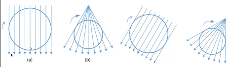
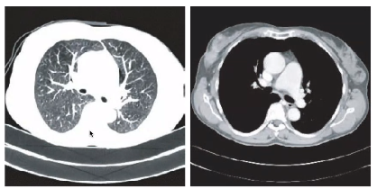
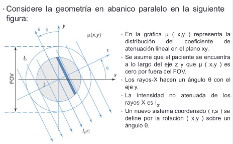
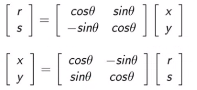
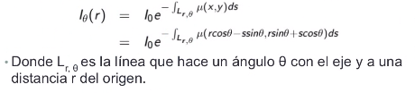
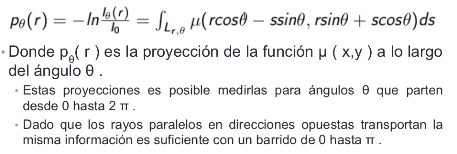
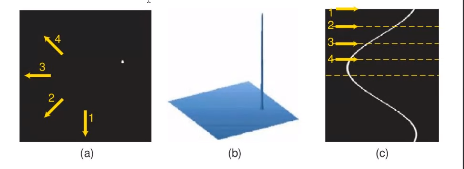
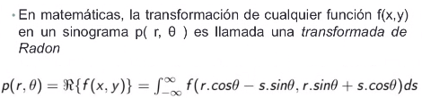

# Tomografía computarizada

Fecha: 30 de Noviembre 2021 

Los rayos-X fue la primera técnica de imagenología y se sigue utilizando.

La tomografía computarizada produce secciones transversales que describen la atenuación que genera el tejido en los rayos-X.

Un conjunto de emisiones en líneas de rayos-X cubren el FOV para diferentes ángulos entregango los perfiles de absorción para todos lo ángulos muestreados. 

Al realizar una sola sección, no es interpretable. Pequeños tubos de rayos catódicos emitiendo de forma catalizada. 

Los elementos básicos para la tomografía computarizada están dados por el descrubrimiento de los rayos-X y por la formulación de Johann Radon que permite la reconstrucción de una señal a partir de sus proyecciones. 

En rayos X existen interacciones atomicas y macroscopicas que atenuan dependiendo de la interacción. 

* El primer escáner CT fue desarrollado por Godfrey N. Hounsfield en 1972
* Su trabajo partió de los experimentos y planteamientos matemáticos desarrollados por A.M. Cormack una década antes.
* Ambos investigadores compartieron el premio novel de fisiología y medicina en 1979

* Los equipos de CT modernos entregan imágenes de 512x512 pixeles que representan números CT
* con esta definición se obtiene que el aire tiene un número CT de -1000, el agua de 0 y el hueso tiene un número CT que va desde los cientos hasta alrededor 1000 HU
* Esto es debido a que el mu del hueso, y el de otros tejidos, varía de acuerdo a la composición y estructura. 

Para la visualización de la tomografía se suelen utilizar los operadores de **ventana y nivel** los cuales definen el rango de grises en los cuales se visualizará la imagen. Mapear los valores negativos a valores positivos para poder ver mejor los diferentes tejidos. 

 

## Adquisición de los datos

- Valor de atenuación para cada posición. 
- Se asume que el paciente esta en el eje z.
- Se asume que el componente te atenuación por fuera es cero. 

Hay relaciones de transfomación a partir de una matrices de transformación (solo contempla rotación):

 

Para un ángulo fijo, se va tener un perfil de intensidad medido como una función de r es: 

  

Cada perfil de intensidad es convertido en un perfil de atenuación:

Relación entre el perfil de atenuación y la relación de atenuación con los tejidos que es un valor desconocido. 

Las atenuaciones es común saberlo entre radiologos, el hueso tiene atenuaciones diferencias levemente en cada persona 

Los tomografos toman sinogramas para un ángulo todos los valores de *r*.  intensidades de los diferentes rayos para cada proyección, y se va apilando. 

La función de proyección tiene una forma senosoidal (sinograma)

Ejemplo para un solo punto: 

 

**Transformada de Radon**

## Reconstrucción: retroproyección
* La reconstrucción de la imagen desde perfiles de proyección resultará de la aplicación inversa de la transformada de Radon
* La absorción en cada píxel es desconocida pero cada haz paralelo entrega lo que sería la solución para un sistema de múltiples ecuaciones
* El número de angulos es límitado por los 512x512 
* Suelen haber más pixeles que direcciones de proyección por lo que se suelen de utilizar métodos iterativos de aproximación (retroproyección filtrada)
* Para corregir el efecto de la retroproyección sobre los pixeles circundantes a pixeles altamente absorberntes se utiliza una combinación de filtros: retroproyección filtrada. Se utilizan también en PET. 

## Imagenología en tres dimensiones

### Tomografía de único corte 

**TC circular**
* La manera más directa de escanear un volumen es obteniendo cortes consecutivos mediante rotaciones de un detector alternados con pequeños desplazamientos del paciente 
* Escaneo axial

**TC helicoidal**

**Tomografía multicorte**
* En los equipos de tomografía actual el arreglo de detectores consiste de múltiples dilas de detectores de manera que es posible realizar múltiples cortes de manera simultanea en un solo giro del tubo del rayo-X.
* El obtener más corte por unidad de tiempo permite reducir la cantidad de movimiento mejorando los estudios 

## Efectos biológicos y seguridad

* Es necesario tener en cuenta que las dosis de radiación son mayores respecto a la imagen de rayos-X convencional
* Esto hace necesario mantener el equipo bien calibrado de manera que la administración de dosis sea óptima.
* Los protocolos deben estar bien estandarizados.

