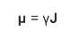
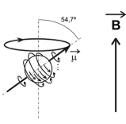
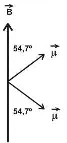
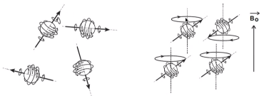
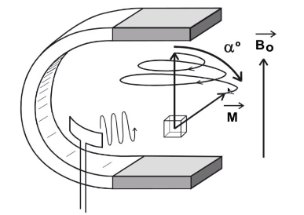
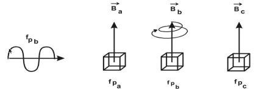
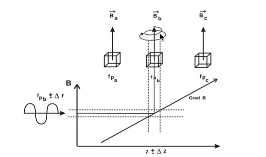

# Resonancia magnética 

Fecha: 02 de diciembre 2021 
## 1. Introducción
Los elementos que llevaron al desarrollo de la resonancia magnética fueron propuestos en la década de 1940.
* En 1973 Paul C. Lauterbur generó la primera imagen por RM. 
* En 1974 Peter Mansfield desarrolló la teoría matemática que permite la generación rápida de imágenes.
* Lauterbur y Mansfield compartieron el premio nobel de medicina o fisiología en el 2003. 

La resonancia hay un fenómeno físico por el cual los núcleos atómicos con una suma impar de protones o neutrones **absorben de manera selectiva** energía de radiofrecuencia. 

Una vez los núcleos han absorbido la energía (*resonancia*) devuelven los excesos de la misma mediante ondas de radiofrecuencia (*relajación*)

La *señal de relajación* depende de muchos fenómenos del ambiente del átomo y es la que transporta información útil para la formación de la imagen por resonancia. 

## 2. Propiedades magnéticas de la materia

* La materia al tener cargas en movimiento posee propiedades magnéticas
* La susceptibilidad magnética (X) mide la tendencia de un material a magnetizarse cuando se encuentra bajo un campo magnético externo
    - Si X<0: material diamagnético (no magnético), útiles para elementos RM compatibles (nivel 1 -distorsión, nivel 2 inertes)
    - Si X>0 material paramagnético. Interactúa con el campo. Hay elementos de contraste (Gadolinio) y peligrosos (ferromagnéticos).

El *cuerpo humano es mayormente diamagnético* con diferencias de susceptibilidad en los tejidos lo que permite el diseño de secuencias con diferentes contrastes. 

En la imagen se observa una imagen de resonancia en la cual hay una..

## 3. Momento angular y momento magnético: descripción cualitativa
Los contribuciones al momento magnético de cualquier sistema pueden provenir de fuentes de dos tipos:
- Movimiento de cargas eléctricas, como corrientes eléctricas.
- El magnetismo intrínseco de partículas elementales

La necesidad de explicar ciertos fenómenos experimentales en mecánica cuántica llevo a plantear la existencia de un momento angular de spin (spin).

El spin no se puede asociar con algún movimiento que tenga equivalencia con otro fenómeno de la física clásica. 

Los protones y neutrones tienen spin. El spin neto de un núcleo es el vector resultante de la suma de los vectores spin de sus protones y neutrones 

Dado que un núcleo atómico es una distribución de cargas, un spin esta asociado con un momento magnético neto. 

con cargas y movimientos va aparecer el campo magnético

### Momento angular y momento magnético : descripción cualitativa 

La relación entre el vector de spin **J** y el vector momento magnético **u** generado por la carga en movimiento, es: 

Donde gamma es el cociente giromagnético nuclear que depende de la carga y la masa. 

* El fenomeno de resonancia magnética se produce por dos factores:
    - La presencia de un fuerte campo magnético externo 
    - La capacidad de absorción selectiva de energía por parte de los átomos

Cuando se aplica el campo magnético externo aparece un fenomeno de precesión del vector mu alrededor del vector B

**El movimiento de precesión** se realiza a una frecuencia conocida como frecuencia de larmor (ley fundamental de la resonancia magnética)

Con el gamma el cociente giromagnético nuclear B es el valor del campo magnético que percibe el núcleo. 

La ley de larmor determina tanto la absorción como la emisión de energía

Variando el campo magnético externo mediante gradientes podemos modificar las frecuencias a las cuales los núcleos absorben energía

De igual manera, el núcleo

Para un núcleo de hidrógeno bajo un campo magnético son posibles dos estados:
1. Estados Up: antes de la absorción de energía.  Por principio de exclusión ciertas particulas atómicas compartan los números atómicas por exclusión
2. Estados DOWM: luego de la absorción de energía 

El principio de exclusión impide que todos los spins se encuentren en el mismo estado. A pesar dle estado UP ser el más probable muchos de los núcleos de hidrógeno estarán en estado DOWN. 

## 4. Magnetización de un elemento de volumen

Los núcleos de hidrógeno en el cuerpo humano tienen, en ausencia de un campo magnético externo, los spines orientados al azar. 
Cuando son sometidos a un campo los spines se ven obligados a realizar precesión en la dirección del campo. 

En RM se interpreta una señal que es la resultante de los movimientos de precesión (magnetización del elemento de volumen M) la cual es la resultante de los movimientos de precesión UP y DOWN de los spines nucleares. Se alinean pero no se percibe. 

  

* Al existir una mayor cantidad de núcleos en estados UP el vector de magnetización resultante tendrá la dirección y sentido del campo magnético externo. 
* Es útil tomar la dirección de B como el eje z del sistema cartesiano del espacio (eje longitudinal).
En el eje XY constituye el **eje transversal** o plano de proyección de los spines. 
* En estado de reposo o de equilibrio térmico M estará orientado a lo largo del eje longitudinal con su componente transversal con un valor *cero*. 

## 5. La excitación nuclear por un pulso de radiofrecuencia
* Es posible hacer que los átomos entren en resonancia si utilizamos una antena que emita señales de radiofrecuencia a la frecuencia de precesión del átomo. 
    - Cuando los núcleos entran en resonancia se genera un movimiento del vector de magnetización **M** (plano longitudinal)alrededor del campo magnético B.
    - Este movimiento tiene una frecuencia igual a la frecuencia de precesión de los núcleos. 

* El propósito de la excitación por RF (radiofrecuencia) es doble: 
    * Perturbar el estado de equilibrio generado por el campo magnético externo
    * Establecer coherencia de fase en el plano transverso y generar una señal de salida medible. 

La separación del vector de magnetización del punto de equilibrio se conoce como flip angle o ángulo de inclinación alpha. 
Su valor depende, entre otras cosas,de la potencia y tiempo de emisión del pulso de radiofrecuencia. 
El grado de saturación de un voxel indica que tan nula se encuentra la componente longitudinal de M.

**Selectividad de la resonancia magnética**
En resonancia magnética es posible excitar de manera selectiva un núcleo tan solo cambiando la intensidad del campo que percibe. 

Esta capacidad de selectividad permite que al introducir variaciones del campo a lo largo de una dirección específica se pueda reconstruir un plano tomográfico. 

  

# 6. Relajación núclear 
Sistema excitador por radiofrecuencia. mientras se mantegna la excitación se tiene el desplazamiento, pero áun no se ha formado la imagen. La imagen la va dar la relajación. 

Finalizada la excitación los núcleos buscan entregar el exceso de energía de manera que puedan volver al *estado de equilibrio*.

  

  

La relajación no es un proceso espontáneo sino que depende de un entorno que sea capaz de recibir la energía que liberan los núcleos. 
Es en este punto donde es relevante el entorno bioquímico en la imagen de resonancia. 

* La relajación depende de muchos fenomenos formando contrastes, es lo que permite formas la imagen, forma la escala de grises. 

El estudio de la señal FID permite estimar la densidad de protones en un voxel y las características del entorno bioquímico mediante los parámetros T1, T2 y T2*. 

**Imágenes potenciadas en densidad**
*El valor de magnetización es proporcional a la densidad de núcleos de hidrogeno que contiene el voxel (D)
*Dos voxeles con distinta densidad tienen magnetizaciones distintas 

Parámetros de relajación
1. **Imagen potenciadas en T1**
La relajación longitudinal indica la rapidez con que el vector de magnetización alcanza de nuevo el estado inicial (La capacidad de liberar energía de manera rápida)
Este patrón es exponencial con constante de tiempo T1 y esta relacionado con el tipo y movilidad de las moléculas con las que H se relaciona. 

La intensidad de la señal es inversamente proporcional a la facilidad de relajación. La grasa con gran facilidad de relajación.

  

  

2. **Imágenes potenciadas en T2**

La relajación transversal esta relacionada con la información bioquímica del medio: cada núcleo libera su energía de acuerdo al campo magnético local que perciba. 

* En una imagen de T2 el nivel de intensidad es directamente proporcional al tiempo de relajación
* Si en un voxel la relajación es muy coherente. 