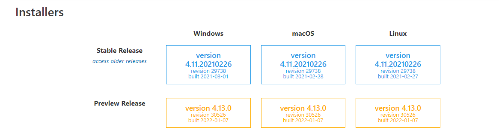
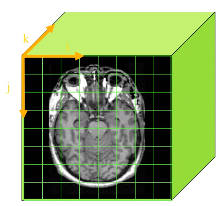
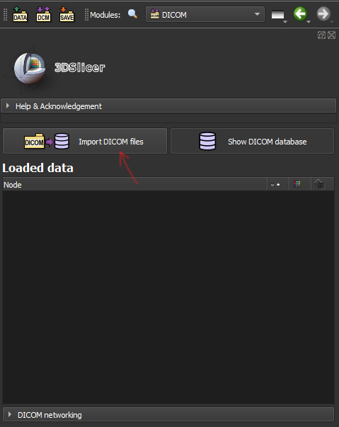

# 3D SLICER CARGA Y VISUALIZACIÓN 

Fecha: 14 de diciembre 2021
## Instalación de Slicer 
[Descargar versión estable](https://download.slicer.org/)

  

## ¿Qué es?

* Software open source para segmentación,registro y visualización 3D de imágenes médicas. 
* Aplicación de usuario final para el análisis de imágenes, además tiene una estructura modular para desarrollo de software .
* Es multiplataforma 

## 1. Carga de imágenes
Formato de las imágenes: *DICOM*, extensión *dcm*
Datos crudos, tiene una cabecera con diferente información.

Representación de la información:
    - Adquisición volumétrica del cerebro
    - Valores de intensidad de la señal son representados en voxeles. 

**Voxel**: Unidad mínima de representación de la imagen volumétrica. 

**pixel**:  Unidad mínima de representación de una una imagen en 2D. 

Normalmente para imágenes T1 es de 1mm.
*Coordenadas*: i,j,k

### Ejemplo slicer
1. Cargar datos
  

## 2. Conversión DICOM-NRRD
## 3. Visualización de volúmen RM
## 4. Renderización de volumenes
## 5. Manipulación de modelos 3D