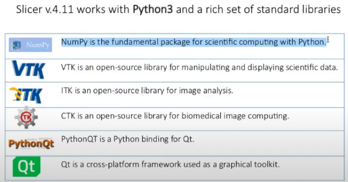
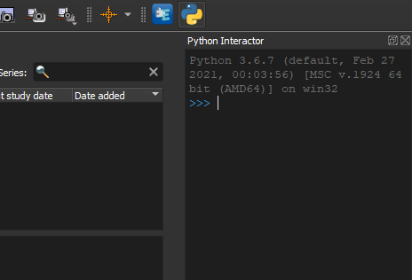
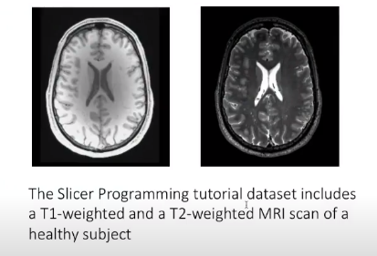
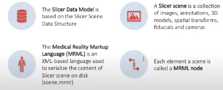
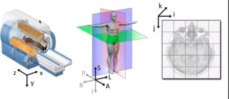
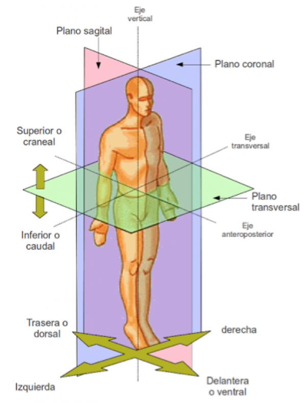
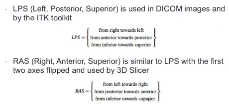

c# Slicer developer tutorial: programming in slicer 

Fecha: 16 de diciembre de 2021

* Este tutorial es una introducción de python interactor y el Qt.

* Software de código abierto para el análisis y visualización de imágenes médicas. 

* El software no esta aprobado por la FDA o CE-marked. Únicamente se usa en la investigación.

## Tipos de módulos de slicer

1. **Command line interface (CLI)**: rutinas preinstaladas, tienen entradas/salidas definidas. 
2. **loadable modules (C++ plugins)**: optimized for heavy computation.
3. **Scripted modules (python)**: Recomendado para el prototipado rápido y el desarrollo de flujos de pre-procesamiento.

## Slicer extensions 
Módulos para descargar. Slicer tiene un gestor de módulos para instalar. 

## Entorno de python en 3D slicer 



* **VTK**:Librería de visualización científica.
* **ITK**: Librería de visualización de imágenes médicas.

La consola de python en slicer esta basada en una consola de Qt. Para acceder a esta, damos click en el ícono correspondiente. 

<center>
  

 
</center>

## Modelo para el manejo de datos 
<center>
 
</center>

## Preprocesamiento de imágenes
Preprocesamiento de imágenes consiste principalmente en dos clasificaciones
1. Filtrado de las imágenes: resaltar una característica.
2. Segmentación: extraer regiones de las imágenes. 
3. Registro:fusionar imágenes.  
4. Visualización, como representar los datos para dar efecto de tridimensionalidad. 


### Sistema de coordenadas en las imágenes

Tipos de sistemas coordenados: 
<center>

</center>
Planos anatómicos: 
* Plano axial
* Plano coronal
* Plano sagital

<center>
 


</center>

* La imágenes médicas que tienen mayor resolución son los rayos X, que se puede tener 2000 px. De acuerdo a la instrumentación del equipo se puede tener un espaciado, guardado a partir de matrices.

* Slicer al soportar tantos formatos, se implementa mucho en la parte de investigación. 

Modelos:
- VTK polygonal data (.vtk, .vtp)
- STereoLithography (.stl)
- Freesurfer surfaces (.orig )

En la guía se encuentra más explicito como manipular una escena en slicer [Guía manipulación escena]()

```python 
escena =  slicer.mrmlScene;
print(type(escena)) # tipo de escena

volumen = escena.GetNodeByID('vtkMRMLScalarVolumeNode1') # Recuperar un volumen de la escena 
imagen = volumen.GetImageData()

volumen = slicer.vtkMRMLScalarVolumeNode() # Crear un volumen nuevo a la escena
volumen.SetAndObserveImageData(imagen)
```

Una imagen se puede crear a partir de código de python de la siguiente forma: 

```python 
imagen = vtk.vtkImageData()
imagen.SetDimensions([10,10,2])#tamanio de la matriz
imagen.SetOrigin([0,0,0]) #origen de la imagen
imagen.SetSpacing([0.78,0.78,1.5]) #espaciamiento entre puntos de la matriz
imagen.AllocateScalars(vtk.VTK_SHORT,1) #tipo de datos, en este caso SHORT
volumen = slicer.vtkMRMLScalarVolumeNode()
volumen.SetAndObserveImageData(imagen)
volumen.SetName('Prueba')
slicer.mrmlScene.AddNode(volumen)
```

**Fiducia**: un punto, son referentes en cirugía para poder relacionar información de las imágenes con los pacientes.

