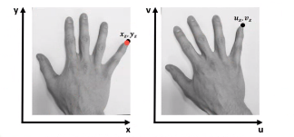

# FILTRADO Y REGISTRO DE IMÁGENES

# Filtrado
## 1. Definición: 

El filtrado es una operación que cambia la calidad de la imagen en términos de resolución, contraste y artefactos. 

Típicamente el proceso de filtrado involucra aplicar una operación matemática a cada píxel de la imagen.

El filtrado espacial modifica la intensidad de cada píxel de una imagen utilizando una función que opera sobre los píxeles vecinos.  

Ej: Mejorar la resolución cuando se le aplica un filtro. 

<center>
  

 
</center>

## TIPOS DE FILTROS: 

## Filtro de mediana: 
Filtro simple que consiste en reemplazar cada pixel de una imagen por la mediana de la vecindad (NxN) alrededor del píxel. La salida del filtro será una imagen con apariencia más suavizada y menos ruidosa que la imagen de entrada. 

<center>

 

  
</center>

###  Ejemplo en slicer de filtro de mediana
1. Cargar imágenes de [dataset 1]()

**Imagen sin filtrar**
<center>

</center>

2. Seleccionar módulo Volume Rendering

    ```Modules-> Filtering -> Denoising -> Median Image filter```

3. Definir el tamaño del filtro
<center>
  
</center>

<center>

**Imagen filtrada**


</center>

4. Seleccionar la imagen de entrada
5. Asignar nombre a imagen de salida 

## Filtro Gaussiano

<center>

</center>

Es muy utilizado, en donde decrece en los extremos. Se especifica un tamaño de aplicación que va determinar el ancho del filtro ya sea en píxeles o voxeles dependiendo de las dimensiones de la imagen. 

A medida que se aumenta el tamaño se puede perder información.A mayor ancho suavizado de la imagen. 

No es el mejor para filtrar bordes, dado que se pierde detalles de los bordes es decir se pierde información a medida que se eliminan los artefactos. 

<center>
  
</center>

## Filtro de difusión anisotrópica

Los métodos de difusión anisotrópica están formulados para **preservar los bordes** ya que permite la eliminación Y **Elimina artefactos de punto** más conocidos como *sal y pimienta*. Es un métodos basado en la aproximación de derivadas parciales mediante diferencias finitas. 

Es un método que ha mostrado eficacia en imágenes MRI en T1 y T2, conserva los bordes. Puede usarse en otras modalidades, pero muestra buenos resultados al trabajarlo sobre imágenes de MRI. 

Suele utilizarse en dos aplicaciones principalmente:
1. Reducción de ruido como paso de pre-procesamiento para segmentación.
2. Paso de pre-procesamiento para reconstrucción volumétrica, permite obtener reconstrucciones volumétrica más limpias. 

Se conserva los bordes sin embargo se puede perder información relacionada en diferentes tejidos, no se recomienda aumentar mucho la **conductancia** ni el **número de iteraciones**. 

Para reconstrucción volumétrica, es más complejo visualizar los vasos y delimitar los bordes por eso es importante quitar los puntos. El realce de bordes es importante para la segmentación. 

<center>

**Imagen de RM original**

 

**Imagen de RM filtrada con conductance=1 y 5 iteraciones**

 

**Reconstrucción volumétrica**


</center>

###  Ejemplo en slicer de filtro de
1. Cargar imágenes de (dataset1)[]
2. Seleccionar modulo de gradiente

    ```-> module->filtering->denoising-> Gradient Anisotropic Diffusion```
3. Definir parámetro conductance: Menor valor de conductividad permite preservar más los bordes y obtener menos suavizado. 
4. Definir número de iteraciones: El número de iteraciones controla la cantidad de suavizado que se realiza dentro de las regiones limitadas por los bordes. 
5. Definir Time step: Depende de la dimensionalidad de la imagen. Para imágenes 3D se recomienda utilizar el valor por defecto. 
6. Seleccionar imagen de entrada
7. Asignar nombre a imagen de salida.

**Imagen filtrada**
<center>
  
</center>
Se suavizo más el tejido. 

___________________________________________________

# Registro

Encontrar los **parámetros óptimos** de una transformación geométrica para **alinear** espacialmente dos imágenes diferentes del mismo objeto. 

Establece correspondencia espacial entre los píxeles de la **imagen móvil** con los de la **imagen de referencia**. 

* i y j son las imágenes de referencia y móvil respectivamente.
* i(x,y) y j(u,v) representan los valores de intensidad de los píxeles ubicados en dos mallas regulares en los espacios de imagen i y j respectivamente.
* Para el mismo sujeto, el mismo punto anatómico z puede estar en la posición x,y y u,v en j. 

<center>
 


</center>

Se aplica una transformación para que coincida con el espacio.

<center>

 
</center>

Posterior al registro, se encuentran en el mismo espacio. 

## Componentes del registro de imágenes:
* *Dimensionalidad*: 2D/2D, 3D/3D, 2D/3D (poco comunes).
* *Transformación*: lineal, no-lineal.
* *Medida de similitud*: intensidades, puntos de referencia, bordes, superficies.
* *Procedimiento de optimización*.
* *Enfoque*: intra-sujeto (para un diagnostico se suele usar varias imágenes), inter-sujeto, construcción de atlas. 

## Tipo de registro
  
Lo más importante es la naturaleza de la transformación puede ser:

* Rígida
* Afín
* Curva
* Proyectiva


### 1. Transformación rígida:
Una imagen 3D tiene 6 grados de libertad:
* 3 traslaciones
* 3 rotaciones

**Matriz de transformación traslación**


**Rotación en x**
  

**Rotación en y**

  

### 2. Transformación afín
Una imagen 3D tiene 12 grados de libertad:
* 3 traslaciones
* 3 rotaciones
* 3 escalados
* 3 skew (inclinar una imagen basada en paralelismo)
<center>
 
</center>

# Aplicaciones

Imágenes médicas contienen información anatómica y funcional que puede correlacionarse con patologías, es necesario hacer una operación de registro porque es llevar información a otro espacio. Ayuda a sacar conclusiones sobre el estado del paciente.  

La imágenes dinámicas contienen variaciones espaciales que deben ser corregidas para obtener métricas más confiables. 

<center>

</center>

* Comparar dos o más imágenes de la misma modalidad.
* Combinar información de varias modalidades del mismo sujeto.
* Estudios longitudinales, monitorear cambios en el tiempo.
* Relacionar imágenes pre y post-operatorias luego de cirugía. 

**Ejemplos:**
<center>

</center>

* Corrección de movimiento probablemente durante la adquisición

<center>
 
</center>

No hay correspondencia durante toda la adquisición porque hubo un movimiento del paciente. 

* Imágenes dinámicas
Durante un largo periodo de tiempo se adquieren cortes de una zona especifica del cuerpo, se obtiene información del contraste.

<center>
  
</center>

**Ejemplo slicer Registro**
Flujo de trabajo 
* Sujeto A
    - Registro afín de la imagen T2w a T1w 
* Sujeto B
    - Registro afín de la imagen T2w a T1w 
* Imágenes T1w
    - Registrar  imagen de Sujeto B a imagen de sujeto A. 

1. Cargar imágenes de dataset 2
2. Cambiar visualización a Four-up
3. Cerrar aros
4. Superponer *SubjectA_T1* sobre *SubjectA_T2* con un umbral 0.6.
5. Seleccionar módulo de registro BRAINS.
6. Definir imagen de referencia e imagen móvil
7. Asignar nombre a archivo con transformación lineal
8. Inicializar la transformación 
9. Seleccionar las fases de registro rígido 6DOF y afín 12DOF. 
10. Ejecutar

Se toma la imagen fija, la de mayor resolución o la que tiene mayor información de interés. 