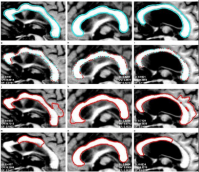

# Segmentación 

La segmentación de imágenes médicas es el proceso de detección automática o semiautomática de límites dentro de una imagen 2D o 3D

Segmentación de tumor cerebral
  

Las imágenes médicas presentan alta variabilidad debido a:
* Anatomía humana
* Métodos de adquisición (rayos X, CT,MRI,PET,SPECT, endoscopia, entre otros)

El resultado de la segmentación se puede utilizar para obtener más información de diagnóstico. 

## Aplicaciones
Segmentación de riñones para detección de tumores utilizando redes neuronales convolucionales y deep learning.

  

Segmentación de riñones para detección de tumores utilizando redes neuronales convolucionales y deep learning. 

Comparación de la predicción vs Ground truth. True label es lo que se acepta por la comunidad científica para identificar que es un tumor. Disminuir tiempos de segmentación manual, quita mucho tiempo, es importante

**Detección y clasificación de lesiones en mamografía con deep learning**

**Qmenta**
Empresa que entrega reportes volumétricos.

## Métodos
1. Métodos convencionales o entrada manual, son pocos flexibles

  

2. Métodos suaves, es un enfoque moderno basado en la idea de la aproximación, la incertidumbre y la flexibilidad. 

  

3. **Métodos basados en modelos**:
Requieren un contorno o forma inicial que posteriormente se actualiza mediante iteraciones a a la forma final esperada de la forma aproximada (2D o 3D)

a. **Modelo de contornos activos**: es un método extenso, nace de un método activo de serpiente puede definirse conceptualmente como una curva elástica que evoluciona desde su forma y posición inicial como resultado de la acción combinada de fuerzas externas e internas. 

* Definición de la curva que representa el contorno activo x,y coordenadas de función.

El contorno final depende de la búsqueda, de poder obtener minización de la función energía para evitar que se salga del contorno del interés para que permanezca estable en los límites. 

Ejemplo: 
1. Edge-based active contour model using an inflation/deflation force with a damping coefficient (EM)
2. Selective binary and gaussian filtering regularized level set (SBGFRLS)
3. distance regularized level set evolution 

El primero es un método muy bueno y el segundo también. 

  

Al encontrar un cambio de energía evita que salga del contorno, y evita que salga 

b. **Umbralización**
Los píxeles individuales en uma imagen se marcan como píxeles de objeto si su valor es mayor que algún valor de umbral y como píxeles de fondo en caso contrario. 

Describe la presencia de uno o varios objetos, se selecciona un línea tipo umbral que nos separe. Estos objetos se clasifican los pixeles que correponden a cada intensidad correspondiente.  la varianza sea la mínima, comparando entre píxeles para diferenciar las clases. 

c. **Umbralización por el método de Otsu**
Para dos clases,una para los píxeles del primer plano y otra para los pixeles en segundo plano.

Se busca crear una mascara binaria para asociar los píxeles para una clase en especifico. Usando la mascara al utilizar una operación, se puede obtener la segmentación entre la imagen inicial y la máscara. Es un método automático. 

d. **Crecimiento de regiones/crecimiento de semillas**

Parte de una semilla. Es una técnica secuencial que inicia con la definción de píxeles semilla para incrementar el tamaño de regiones.
Si se tiene la matriz de intensidades de una imagen y definimos una semilla, se compara los vecinos para encontrar l. Se detiene cuando ya no se tiene similitud.

e. **Médotos de machine learning**
Modelos de aprendizaje automático.

d. Métodos hibridos
Los métodos híbridos combian diferentes 

## Operaciones morfológicas 
Permiten realizar cuatro operaciones básicas:
* Erosión 
* Dilatación
* Cierre
* 

1. Erosión
Para una imagen I y vecindario H, la operación se representa como I /theta H
Consiste en la eliminación de todos los pixels del objeto en cuyo vecindario haya al menos un píxel que pertenezca al fondo. Evaluá que tantos vecinos no son de su clase y lo elimina. 
2. Dilatación
Ampliar la zona del objeto. No logra abarcar toda la región de interés, Se usa para cerrar agujeros. 

3. Apertura
Consiste en la ejecución de una erosión seguida de una dilatación. Se utiliza para eliminar elementos salientes, es decir, suavizar los contornos de un objeto. 
Esta representada por: 
4. Cierre
Consiste en la ejecución de una dilatación seguida de una erosión. Se utiliza para rellenar agujeros.
  

## Ejemplo práctico
Dataset 1

