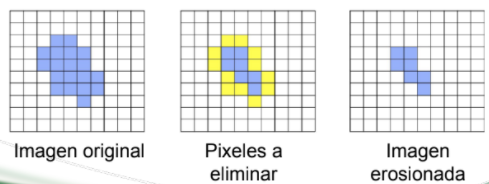

# Segmentación y operaciones morfológicas 

Fecha: 20 de enero 2022

Autor: Luisa María Zapata Saldarriaga 

# Segmentación
La segmentación de imágenes médicas es el proceso de **detección automática** o semiautomática de límites dentro de una imagen 2D o 3D. Los límites van a representar la imagen de interés. 

**Segmentación de tumor cerebral**

Las imágenes médicas presentan alta variabilidad debido a:
* Anatomía humana
* Métodos de adquisición (rayos X, CT,MRI,PET,SPECT, endoscopia, entre otros)

El resultado de la segmentación se puede utilizar para obtener más información de **diagnóstico**. 

## Aplicaciones
Segmentación de riñones para detección de tumores utilizando redes neuronales convolucionales y deep learning.

**Detección de tumores utilizando redes neuronales- deep learning**

  

Comparación de la predicción vs Ground truth. True label es lo que se acepta por la comunidad científica para identificar que es un tumor. Disminuir tiempos de segmentación manual, quita mucho tiempo, es importante para no depende de una persona. 

**Detección y clasificación de lesiones en mamografía con deep learning**

Imágenes de mamografía especializada tomosíntesis. Lo hace un algoritmo muy avanzado basado en aprendizaje profundo. 

**Qmenta**
Empresa que entrega reportes volumétricos o medidas de regiones cerebral.

Identifica regiones sub-corticales y reporta el volumen de las regiones y lo compara con valores de referencia. 

**Sub-proceso en flujo de procesamiento**

## Métodos

1. **Métodos convencionales** `Hard computing` o entrada manual, son pocos flexibles

  

2. **Métodos suaves** `Soft computing`, es un enfoque moderno basado en la idea de la aproximación, la incertidumbre y la flexibilidad. Son muy buenos para segmentación con redes de convolucionales.  

 

3. **Métodos basados en modelos**:

Requieren un contorno o forma inicial que posteriormente se actualiza mediante iteraciones a a la forma final esperada de la forma aproximada (2D o 3D) o bordes aproximados.

Las actualizaciones se realizan con base a un conocimiento definido a priori sobre como estos métodos determinan los bordes probables de los objetos. 

a. **Modelo de contornos activos**: 

Es un método extenso, nace de un método activo de serpiente puede definirse conceptualmente como una curva elástica que evoluciona desde su forma y posición inicial como resultado de la acción combinada de fuerzas externas e internas. 

* Definición de la curva que representa el contorno activo `x,y` coordenadas de función, `s` espacio paramétrico.

* Función asociada a la forma del contorno sujeto a una imagen. `E: energía`

El contorno final depende de la búsqueda, de poder obtener minimización de la función energía para evitar que se salga del contorno del interés para que permanezca estable en los límites. 

Dependiendo de su ubicación, afectará como se configuran las ecuaciones de energía. El problema de encontrar el límite del objeto es un problema de minimización de energía. 

**Ejemplo:** 
1. Manual realizada por médico experto.

 

2. Edge-based active contour model using an inflation/deflation force with a damping coefficient (EM).

 

 

3. Selective binary and gaussian filtering regularized level set (SBGFRLS).

 

4. distance regularized level set evolution 

 

El primero es un método muy bueno y el segundo también.Sim embargo el tercer  método toma información que no corresponde a la región y el cuarto no toma toda la información. 

Al encontrar un cambio de energía evita que salga del contorno, y evita que salga 

4. **Métodos basados en regiones:**

a. **Umbralización**

Los píxeles individuales en uma imagen se marcan como píxeles de `objeto` si su valor es mayor que algún valor de umbral y como píxeles de `fondo` en caso contrario. 

Describe la presencia de uno o varios objetos, se selecciona un línea tipo umbral que nos separe. Estos objetos se clasifican los pixeles que corresponden a cada intensidad correspondiente.  la varianza sea la mínima, comparando entre píxeles para diferenciar las clases. 

  

b. **Umbralización por el método de Otsu**
Para dos clases,una para los píxeles del primer plano y otra para los pixeles en segundo plano, el método utiliza la varianza para minimizar entre los píxeles de la misma clase y maximizarla entre píxeles de clase diferente.

Se busca crear una mascara binaria para asociar los píxeles para una clase en especifico. Usando la mascara al utilizar una operación, se puede obtener la segmentación entre la imagen inicial y la máscara binaria, se asocia los píxeles con una clase en especifico. Es un método automático. 

 

El método busca el umbral que asegura las dos clases y que tenga una mínima varianza. 

c. **Crecimiento de regiones/crecimiento de semillas**

Parte de una semilla. Es una técnica secuencial que inicia con la definición de píxeles semilla para incrementar el tamaño de regiones.
Si se tiene la matriz de intensidades de una imagen y definimos una semilla, se compara los vecinos para encontrar l. Se detiene cuando ya no se tiene similitud.

5. **Médotos de machine learning**

Modelos de aprendizaje automático, permiten identificar patrones complejos a partir de imágenes,el reconocimiento o distinción de características permiten la segmentación. 

6. **Métodos híbridos**
Los métodos híbridos combinan diferentes técnicas que pueden provenir de varios grupos y categorías de métodos utilizados en la segmentación.  

___________________________________________________

# Operaciones morfológicas 

Los operadores morfológicos permiten manipular la forma de las imágenes. 

Permiten realizar cuatro operaciones básicas:
* Erosión 
* Dilatación
* Cierre
* Apertura

1. **Erosión**

Para una imagen `I` y vecindario `H`, la operación se representa como `I /theta H`.

Consiste en la eliminación de todos los pixels del objeto en cuyo vecindario haya al menos un píxel que pertenezca al fondo. **Evaluá que tantos vecinos no son de su clase y lo elimina**. 

  

2. **Dilatación**

Ampliar la zona del objeto. No logra abarcar toda la región de interés, Se usa para **cerrar agujeros pequeños**. 

3. **Apertura**
Consiste en la ejecución de una erosión seguida de una dilatación. Se utiliza para eliminar elementos salientes, es decir, suavizar los contornos de un objeto. 

Esta representada por: 

  

4. **Cierre**
Consiste en la ejecución de una dilatación seguida de una erosión. Se utiliza para **rellenar agujeros pequeños sin alterar el tamaño del objeto** o suavizar el contorno.

Esta representada por: 

 

Primero dilatamos y luego erosionamos. 

  

___________________________________________________

## Ejemplo práctico en Slicer

[Dataset 1]()

Imagen CT de los pulmones

* Usar la herramienta Segment Editor de Slicer
* Utilizar el método de crecimiento a partir de semillas

Segmentar 3 tejidos:
* Pulmones
* Vías aéreas
* Otros tejidos

[Dataset 2]()

Imagen CT de los riñones

* Usar la herramienta Robust Statistic Segmenter

- Approximate volume: 150 ml,
- Intensity homogeneity: 0.7,
- Boundary smoothness: 0.4

