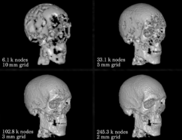

# Visualización 3D y volume rendering

Fecha: 25 de enero 2022

Autor: Luisa María Zapata Saldarriaga 

La visualización cientifica es un método de la computación que permite convertir datos simbólicos adquiridos en formas geométricas. 

Permite comprender, analizar e interpretar la información. Ya que 2D puede ser más dificil de interpretar. Su crecimiento ha sido posible gracias a avances en los métodos computacionales. 

La visualización científica es la base detrás del crecimiento de varios campos:
* Gráficos por computadora
* Procesamiento de imágenes y señales
* Visión por computadora
* Ciencias cognitivas
* Geometría 

En imágenes tenemos datos 3D es CT, RM y PET. Las aplicaciones CAD para apoyo diagnóstico, asistencia en cirugía (neurocirugía, diseño y ajuste de prótesis) y simuladores de entrenamiento (visualización de la compleja anatomía osea).

  

## Datos volumétricos

Un volumen es un conjunto de muestras representadas S (x,y,z,)

La información 3D puede variar en el tiempo, en ese caso el conjunto de muestras estará representada como S(x,y,z,t,v)

El conjunto de muestras son muy pesados, ya que contiene mucha información. Este conjunto de muestras tiene algunas propiedades:

* Isotrópico: el espacio entre muestras es constante en todos los ejes.
* Anisotrópico: puede existir tres 

La 3ra dimensión puede estar asociado al número de cortes. Un volumen es una matriz 3D conformada por voxeles que se puede visualizar como un conjunto de cortes 2D. 

Ej: reconstrucción volumétrica del cerebro a partir de varios cortes. 

  

## Métodos

El diagrama de flujo para la visualización de volúmenes. Las operaciones pueden de acuerdo a las características de los datos. 
  

a. **Visualización indirecta- renderizado de superficies**

Busca obtener una representación 3D de una superficie a partir de primitivas como polígonos. Conlleva a una perdida inherente de información. 

La mayoría de los métodos de representación de superficies. 

- Requiere definición de un umbral definido por el usuario.
- Los límites del objeto se extraen utilizando un operador detector de bordes.
- Se genera una malla poligonal

**Cubos marchantes**
Es un algoritmo para la extracción de isosuperficies que crea una malla poligonal a partir de un modelo de vóxel. Los voxeles tiene unos vertices que se le asocia el valor. y esos valores generan unos poligonos generando la construcción tridimensional.

El conjunto de poligonos muy pequeños es lo que permite generar la superficie tridimensional. El algoritmo parte de una información mínima el cual se conoce como vóxel. Para un cubo se tienen 8 vertices, cada vértice tiene asociado un valor en caso de no ser binarios. Se establece un valor de que pertenece o no pertenece a la superficie, si es binario 1: pertenece 0: pertenece, mientras que si tenemos varia intensidad el algoritmo necesita un umbral de referencia. 
  

  

Pasos:
1. Identificar los vóxeles que se cruzan con el valor umbral
2. Se examina estos vóxeles y se produce un conjunto de uno o más polígonos que luego son renderizados. Se tienen 15 posibles formas. 
3. Cada uno de los vértices del xocel puede estar dentro o fuera del valor de la isocuperficie. 
4. Hay 2^8= 256 formas posibles en las que una superficie puede interceptar.
5. Se determinan los puntos exactos de intersección de los bordes y se crean los polígonos, Por simetría las 256 formas se pueden reducir a 15 formas únicas.

El `isovalor`, es el que determina que información entra o no, entonces es un paramétro muy importante. 

  

**Desventajas**
- En el tamaño de los datos es muy grande requiere mucho tiempo para extraer las características geométricas y renderizar la superficie.

- El volumen está representado por la superficie, por lo que la mayor parte de la información interna se pierde durante el proceso de renderizado a menos de que se reconstruya de la misma manera. 

b. **Visualización directa- renderizado de**

Busca capturar toda la información de un volumen 3D en una imagen 2D. 

Renderizar directamente el volumen segmentado con ayuda de funciones de transferencia, no extrae estructuras 

**Ray casting**
Esta técnica dispara un rayo desde cada píxel en el plano de visualización hacia el volumen para determinar los valores de color y opacidad. 

Por detrás hay mucho calculo matemático.Inicialmente se parte desde el volumen, aplicamos:
* El método `Ray path calculation`, el cual determina los vóxeles que son penetrados por un rayos dado. 
* `Interpolation`, la interpolación estima el valor en una ubicación de re-muestreo utilizando una pequeña vecindad de valores de vóxel. 
* `Gradient`La estimación del gradiente estima una superficie normal utilizando una vecindad de vóxeles que rodean la ubicación de la nueva muestra.
* `Classification`La clasificación mapea valores
de muestra interpolados y la superficie estimada normal a un color y opacidad.
* `Shading`, El sombreado utiliza la
información de gradiente y clasificación para calcular un color que tiene en cuenta la interacción de la luz en las superficies estimadas del conjunto de datos.
* `Composition`, la composición utiliza valores de color sombreados y la opacidad para calcular un color de píxel final para mostrar.

