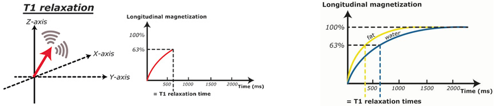

# Marzo 03 de 2022
# Imágenes por resonancia magnética

Se encuentra el paciente, en donde se presenta un campo paralelo y homogeneo. Dependiendo de la capacidad de este se va tener la misma magnitud. En las capas más externas se encuentran unas bobinas que generan unos gradientes diferenciales de campo magnético en tres direcciones. 

Se modula, el componente principal del campo magnético. Existen también pulsos de radiofrecuencia, son parámetros que se modifican según el estudio a realizar. Dependiendo de la propiedad que se quiera evaluar. No se puede modificar el campo de gran intensidad. 

* Bobinas receptoras

Las moléculas se direcciona paralelo al campo magnético. Los gradientes y el pulso de radio frecuencia se utiliza para sacar las moléculas del estado, las partículas regresan a una posición, y liberan energía captada por la bobina receptora, que permite re-construir la imagen.

  

Se tienen los atomos de hidrogeno, orientado hacia el campo de excitación por medio del pulso de radiofrecuencia, que saca los átomos de su orientación inicial y se tiene unas componentes  en el plano XY. Cuando se emite el pulso de radio frecuencia, se observa que los átomos se mueven en precesión a una frecuencia denominada `Larmor` con la presencia del pulso, y estan todos en fase. 

A medida que se saca el pulso, se recupera la posición inicial, este tiempo se conoce como **T1**, el cual es el tiempo que tarda en cambiar del estado excitado al estado inicial.

  

El equipo que contiene elementos computacionales, y por medio de una transformada de Fourier se logra capturar la imagen, que contiene las propiedades de cada tejido, en el tiempo T1.

T1: tiempo de que tan rapido los protones se realinean con el campo magnetico, y cada tejido tiene un tiempo T1, diferente

Es una imagen estructural, porque permite diferenciar cada una de las estructuras, tiene una alta resolución espacial. 

En el proceso de excitación, los protones están en fase, cuando se tienen el pulso de radio frecuencia, se tienen unos cambios debido a la interacción de los átomos. 
Si se captura el tiempo, conocido como T2, pero la imagen obtenida.

## Imágenes de resonancia magnética funcional

Permite evaluar, procesos que se dan en el cerebro como memoria,lenguaje, atención, emociones y reposo,actualmente se esta examinando la conciencia. 

BOLD (Blood Oxygenation Level Dependent): Medida inhomogénea producidas en el campo magnético debido a cambios en la oxigenación de la sangre. 
Respuesta, que permite medir las diferencias entre la sangre desoxigenada y oxigenada, ya que el oxigeno se transport por medio de la hemoglobina

* $Sangre$ $oxigenada$: **diamagnética** (no interactuá con el campo, por tanto no se va tener perdida de señal)
* $Sangre$ $desoxigenada$: **paramagnetica** (Produce cambios en la señal, interactúa con el campo)

Se mide la relación entre ellas

* Baja relación desoxigenada/oxigenada sangre: decrecimiento lento en la señal MRI
* Alta relación desoxigenada/oxigenada sangre: decrecimiento rápido en la señal MRI

Hay un alto consumo energético, cuando se esta realizando actividad neuronal. Hay un incremento del volumen sanguíneo, y produce cambios en la magnetización.

  

Se ha encontrado una sincronía a pesar de que anatómicamente no se encuentren en la misma zona, pero temporalmente están sincronizadas, se conoce como redes cerebrales. 

Una propiedad de estas señales es que son de muy baja frecuencia 0.01 a 0.8 Hz, las frecuencias de EKG y las respiración están por encima de estas.

La señal esta relacionada con la respuesta metabólica. 

**$Bandas$ $de$ $interés$**

* $Slow 5$  (0.01- 0.027 Hz)
* $Slow 4$ (0.027- 0.073 Hz)
* $Slow 3$  (0.073-0.198 Hz)

La señal BOLD no es una medida  directa de la actividad neuronal, es un medida indirecta.

Durante el proceso de adquisición. 

Si se quiere mayor resolución anatómica, se requiere un tamaño de voxel muy pequeño, y se va requerir mayor número de cortes. 
Cada equipo, permite obtener los equipos en diferente orden. 

Aplicar un método de corrección, cada cuanto se quiere un volumen, es conocido como el tiempo de corrección. Es un tiempo muy muy pequeño.

Se recomienda el tiempo de repetición mayor a 2000 ms. si se hace por debajo de ese tiempo, no se debe realizar esta corrección. 

  

Cada tiempo de repetición, vamos a obtener un volumen que esta dividido en diferentes cortes,va estar relacionado con el tiempo. Es común encontrarlo de 10 mn.

Ese TR esta limitado por las características del equipo, desde 500 ms, se puede tener miles de volúmenes.

  
