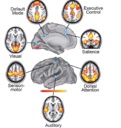

# Resonancia manética funcional 

Estudiar redes de conectividad ante reposo. 

  

También se obtiene una red de conectividad a partir de paradigmas. La red por defecto solo es posible obtener en reposo. 

